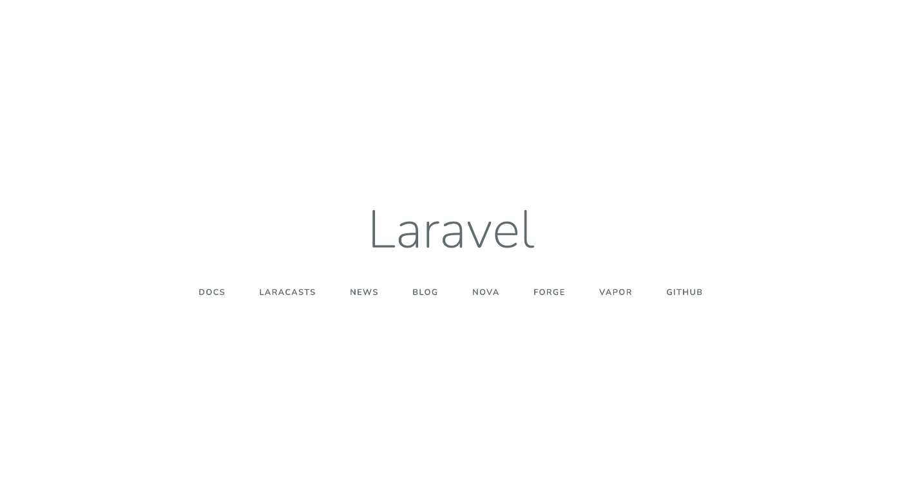

# 1.環境構築

さて、いよいよ課題も終盤です。
PHP フレームワークの Laravel を活用したアプリケーションの作成を行っていきましょう。また、docker の基礎と Laravel のお勧めリンクを記載しています。しっかりと読んでから次のステップに進んでください。

まずは環境構築からです。最初の環境構築で登場した仮想環境の docker を使用します。

## docker の基礎について

docker の基本コマンドについて学習をし、その後実際に作業をしましょう。
docker については、ここで新たに説明するより zenn に綺麗にまとまった記事があるのでそちらを参照していただきます。
https://zenn.dev/suzuki_hoge/books/2021-04-docker-picture-60fbe950136be9c7ad85/viewer/2-image-and-container

## 環境構築（作業）

### VSCode でプロジェクトを立ち上げ、ターミナルで以下を実行する

```
$ docker -v
//バージョンが表示されれば完了です。

$ docker-compose -v
//バージョンが表示されればOKです。

$ cd XXXXX/XXXXX
$ docker-compose build
//バージョンによっては docker compose build

$ docker-compose up -d
//バージョンによってはdocker-compose up -d
//課題の環境が立ち上がる

$docker stop
//立ち上がっている環境を停止する
```

動作確認は、各コンテナを立ち上げた後ブラウザで[http://localhost](http://localhost) にアクセスをして、以下の画面が立ち上がれば完了です。

<!--  -->

:::message
上記のキャプチャをウェルカム画面と言ったりしますが、バージョンによって異なります。
Laravel と表示された画面がでれば成功です。
:::

## Laravel 学習について

Laravel の基礎については、以下のサイトに情報がまとまっているため参照してください。
https://zenn.dev/imah/articles/31c28f306487e2e5d141

#### 特に調べて欲しいキーワード

- ルーティング
- コントローラー
- モデル
- マイグレーション
- シーダー
- blade
- MVC モデル
- CRUD 処理
- 例外処理
- バリデーション
- ファサード

:::message
Laravel ラーニングページは後日作成予定です。
:::

# 2.Laravel の基礎

まずは、基礎的なアプリケーションを作成してみましょう。
課題として、WEB アプリケーションでは基本となる CRUD 機能の処理を実装していただきます。
先ほど立ち上げたプロジェクトの resources/views/samples フォルダの中にサンプルの html を入れました。
そちらを Laravel 化するのが今回の課題です。
フロントの共通化についても、うまく blade ファイルのテンプレート化機能を駆使してみてください。
:::message
今回は HTML が複数ページあるため、GitHub 上で確認をしてください。
:::

## 課題

#### 【Laravel_2-1】 HTML でできたモックアップにバックエンド処理を実装しよう

# 3.最終課題

さて、いよいよ最終課題です。あと一息なのでがんばりましょう！

最終課題は、実践向けにこちら（クライアント）が用意した要件に従ったアプリケーションの作成を
していただきます。

なお、一応バックエンド課題ですがフロントエンドの実装も行っていただきます。
フロントエンドについては、ゼロから HTML,CSS,JavaScript の実装をするのは大変なので、便利な CSS フレームワークを活用しましょう！
以下におすすめのものを記載しておくので活用してください！

## (1)Bootstrap

公式ドキュメントの Components にはあらゆるパーツが用意されており、Utilities にはスタイルの設定方法が記載されています。
基本的な使い方は、Bootstrap で規定されたクラス名を指定するだけでそのパーツやスタイル、アニメーションが設定されるため、CSS や JavaScript が不要になります。
https://getbootstrap.jp/
https://hackerthemes.com/bootstrap-cheatsheet/

## (2)Tailwind CSS

Tailwind CSS の使い方は Bootstrap と同じく HTML タグのクラス名に指定するだけでスタイルの設定ができます。
Bootstrap と違う点は、スタイルの設定が Bootstrap より細かい設定が可能となっています。
https://tailwindcomponents.com/
https://tailwindcomponents.com/cheatsheet/

#### Tips. チートシート

Bootstrap や Tailwind CSS にもある通り、コピペすれば使えるチートシートというものがあります。
言語やフレームワークによっては存在するため、あったら参考にしてみてください。

## 課題

#### 【Laravel_3-1】 以下の要件を満たすアプリケーションを作成してください。

---

#### ＜必須画面＞

- ログイン
- ユーザー登録
- ユーザー編集
- ユーザー一覧
- 承認一覧
- 承認申請
- 承認申請修正

#### ＜必須機能＞

- ユーザーはメールアドレス、パスワード、権限ステータス、ユーザー名で登録される
- ログインはメールアドレス、パスワードでログイン可能
- ログイン中のみ、ログアウト機能
- ユーザー権限は「一般」「管理者」「admin」の３種類が存在する
- admin 権限を持つユーザーのみユーザー一覧画面にアクセスできる
- admin 権限を持つユーザーと本人のみユーザーデータを削除できる。ただし、論理削除
- ユーザー情報の編集は本人と admin 権限を持つユーザーのみできる
- ユーザーの権限の修正は、admin 権限を持つユーザーのみできる
- 全ユーザーが承認申請をすることができる
- 申請ステータスが「確認待ち」かつ申請を出した本人のみ承認申請の修正ができる
- 申請のステータスは「確認待ち」「確認中」「承認済み」「破棄」の４種類が存在する
- 管理者と admin ユーザーのみ「確認待ち」から「確認中」にステータスが変更できる
- 管理者と admin ユーザーのみ「確認中」から「承認済み」にステータスが変更できる
- 管理者と admin ユーザーはいつでも「破棄」にステータスが変更できる
- 登録した本人は、「確認中」から「破棄」にステータスが変更できる
  > 物理削除（非論理削除）

テーブルのレコードから物理的にデータを消去する。復元不可能

> 論理削除

削除フラグのオンオフにより、あたかも消えたかのようにデータを扱う。論理削除を用いることでデータの復元が可能となる。
