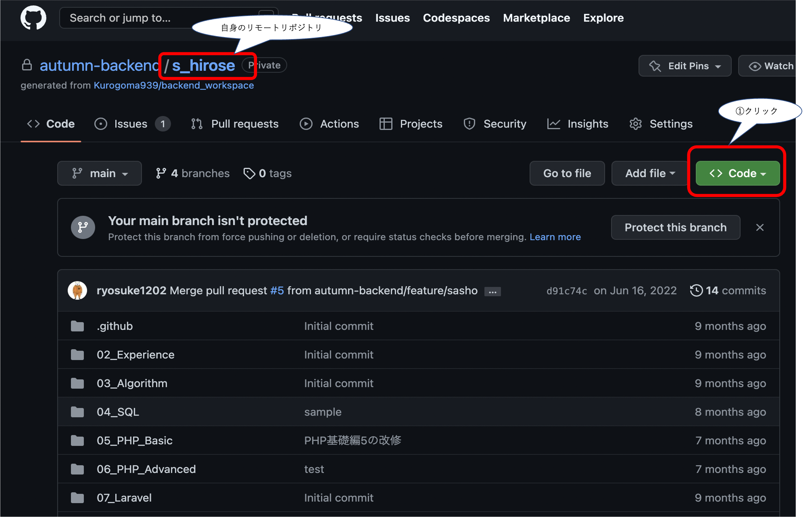
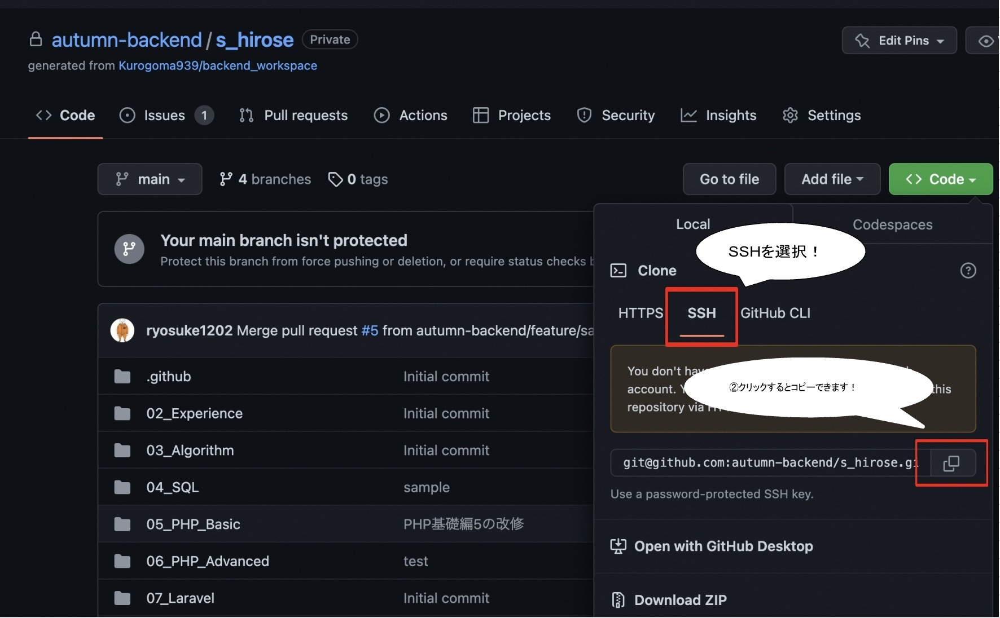
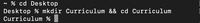
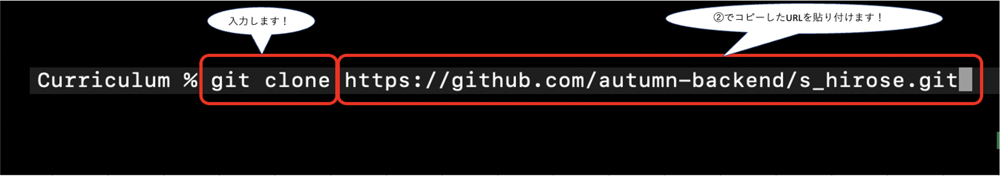

下記画像の手順でcloneを行ってください！
- [ ] ①codeボタンのクリック



- [ ] ②コピーボタンをクリック
      

- [ ] ③ターミナル(MAC)またはコマンドプロンプト(Windows)で実行するため、
下記コマンドを順に実行してください。
ディレクトリ(作業場所)に移動
(カリキュラムの手順)
```
cd Desktop
mkdir Curriculum && cd Curriculum
```



- [ ] ④git cloneコマンドの実行
※下記は例なので、必ず自身のリポジトリ名かどうか確認してください。
```
git clone https://github.com/autumn-backend/自身のリポジトリ名.git
```

以上でクローン作業は終了となります！
お疲れさまでした！
     
      
